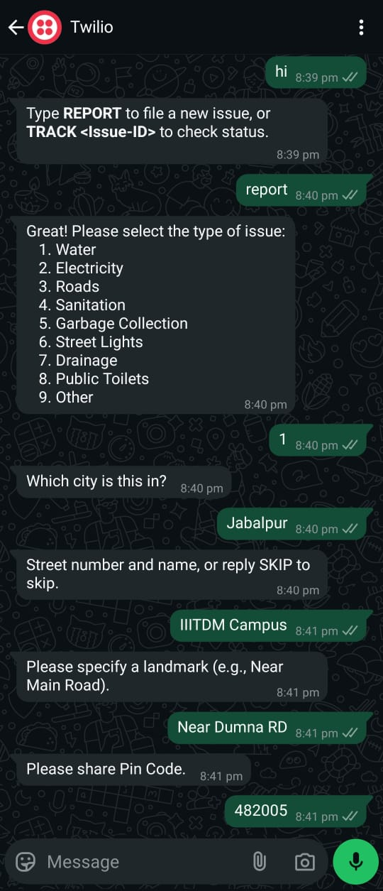
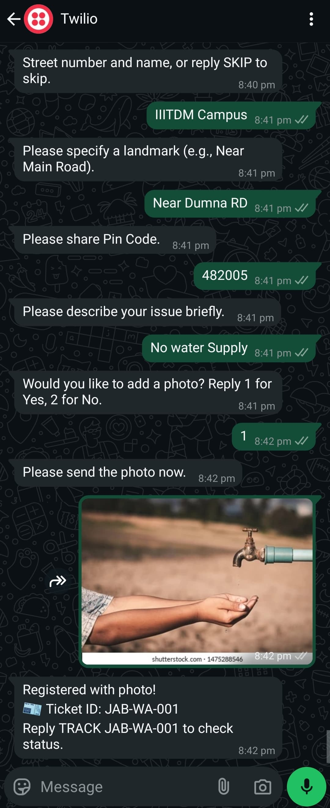

# JanSahayak – Municipal Grievance Management System

JanSahayak is a full-stack municipal grievance management system. Citizens can report municipal issues through WhatsApp, and the system supports efficient issue resolution through a web portal with role-based dashboards for administrators and employees.

## Project Workflow

1. Citizen reports an issue via WhatsApp.
2. An NLP service (spaCy) classifies the urgency of the issue.
3. Admin reviews and assigns the issue to an employee (status: "assigned").
4. Employee updates the issue with resolution status (resolved/unresolved), comments, and resolution date.
5. Admin verifies the resolution and closes the issue (status: "closed").
6. User can track the issue status via WhatsApp.

## How to File an Issue via WhatsApp

> ⚠️ *Note: Due to Twilio's free-tier limit, only 2–3 issues can be filed per day.*

1. **Register your number**  
   Send the join code **"join wish-machinery"** to **+1 415 523 8886** to register with the WhatsApp bot (Twilio Sandbox).

2. **Start the Conversation**  
   Send **"Hi"** to the WhatsApp bot to begin.

3. **Follow the Prompts**  
   - Send **"report"** to start filing an issue.
   - Select the appropriate **department**.
   - Provide your **location**: city, street (optional), landmark, and pincode.
   - Describe the **issue** clearly.
   - Optionally, **upload a photo** related to the issue.

4. **RESET and BACK Commands**  
   - Send **"reset"** to restart the issue filing process.
   - Send **"back"** to return to the previous step.

5. **Track Your Complaint**  
   You can track the current status of your issue by simply messaging the bot.

### Sample WhatsApp Conversation

<table>
  <tr>
    <td>
      
    </td>
    <td>
      
    </td>
  </tr>
</table>

## Roles and Permissions

### Admin

- View dashboard, issues, and users.
- Assign issues to employees.
- Close issues after verification.

### Employee

- View assigned issues.
- Update resolution status, comments, and resolution date (if issue is not closed).
- View closed issues in read-only mode.

## Project Structure

```
JanSahayak/
|
├── frontend/             # React-based admin/employee portal
├── backend/              # Node.js + Express REST API
└── whatsapp-chatbot/     # WhatsApp chatbot with spaCy NLP (Flask)
```

## Setup Instructions

### Frontend

Navigate to the `frontend` directory and run:

```bash
npm install
npm run dev
```

Create a `.env` file:

```
VITE_API_BASE_URL=http://localhost:7000
```

### Backend

Navigate to the `backend` directory and run:

```bash
npm install
npm start
```

Create a `.env` file:

```
PORT=7000
MONGO_URI=your_mongo_connection
JWT_SECRET=your_jwt_secret
TWILIO_ACCOUNT_SID=your_twilio_sid
TWILIO_AUTH_TOKEN=your_twilio_token
```

### WhatsApp Chatbot (NLP + Flask)

Create a `.env` file:

```
PORT=5000
MONGO_URI=your_mongo_connection
FLASK_URL=http://localhost:6000
FLASK_PORT=6000
```

Navigate to the chatbot services and run:

```bash
cd whatsapp-chatbot/services/flask_services
pip install -r requirements.txt
python -m spacy download en_core_web_md
python app.py
```

## Webhook Setup

1. Start the backend server (`npm start` in backend directory).
2. Use localtunnel to expose port 5500:

```bash
npx localtunnel --port 6000
```

3. Copy the generated URL and set it as your webhook in Twilio:

```
<your-localtunnel-url>/webhook
```

4. In Twilio Console, go to Messaging > Settings > WhatsApp Sandbox Settings and paste the webhook URL.

## License
This project is licensed under the MIT License. See the [LICENSE](LICENSE) file for details.

## Contributors

- Pitamber Paudel
- Aditya Raj
- Ayushman Jaiswal